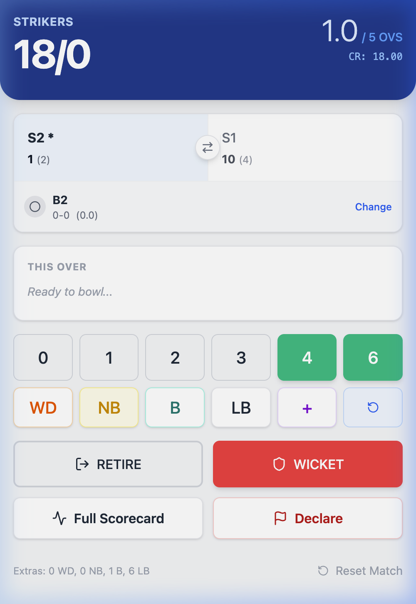

# 🏏 Cricket Scorer

[](https://react.dev)
[](https://vitejs.dev)
[](https://tailwindcss.com)
[](https://www.docker.com)
[](https://abhijeetnazar.github.io/cricket-scorer/)
[](LICENSE)

A mobile-first cricket scoring progressive web app. Track live scores, batting & bowling stats, extras, overs, and export the full scorecard as PNG or PDF — all offline, no backend needed.

---

## 📸 Screenshot



---

## ✨ Features

- **Live scoring** — 0-6, boundaries, wides, no-balls, byes, leg-byes, custom runs
- **Extras run picker** — select additional runs off every wide / no-ball / bye / leg-bye delivery
- **Full scorecard** — batting (R, B, 4s, 6s, SR) + bowling (O, R, W, WD, NB, Econ) + over history
- **Undo** — up to 60 steps of persistent undo via `localStorage`, survives page refresh
- **Export** — download scorecard as PNG (`html-to-image`) or PDF (`pdf-lib`)
- **Two-innings match** — innings break, target display, optional declaration
- **Mobile-optimised** — full-screen scorecard, compact scoring pad with 2-row button grid

---

## 🚀 Local Development

### Prerequisites
- Node.js ≥ 18
- npm ≥ 9

### Steps

```bash
# 1. Clone
git clone https://github.com/abhijeetnazar/cricket-scorer.git
cd cricket-scorer

# 2. Install dependencies
npm install

# 3. Start dev server (hot-reload)
npm run dev
```

Open **http://localhost:5173/cricket-scorer/**

---

## 🐳 Docker

### Using Docker Compose (recommended)

Two profiles are provided — `dev` for hot-reload development and `prod` for the nginx-served production build.

#### Development (hot-reload)

```bash
docker compose --profile dev up
```

App available at **http://localhost:5173/cricket-scorer/**

#### Production (nginx)

```bash
docker compose --profile prod up --build
```

App available at **http://localhost:8080/cricket-scorer/**

---

### Using Docker directly

#### Build & run production image

```bash
# Build
docker build -t cricket-scorer .

# Run
docker run -p 8080:80 cricket-scorer
```

Open **http://localhost:8080/cricket-scorer/**

#### Stop & remove

```bash
docker compose --profile prod down
# or
docker stop $(docker ps -q --filter ancestor=cricket-scorer)
```

---

## 📦 Production Build (without Docker)

```bash
# Build static assets to ./dist
npm run build

# Preview the production build locally
npm run preview
```

---

## 🌐 Deploy to GitHub Pages

The app is configured with `base: '/cricket-scorer/'` in `vite.config.js`.

### One-time setup

1. Go to **GitHub → your repo → Settings → Pages**
2. Set source to **GitHub Actions**

### Deploy

```bash
# 1. Build
npm run build

# 2. Push dist to gh-pages branch
npm install -D gh-pages          # if not already installed
npx gh-pages -d dist
```

The live URL will be:
```
https://<your-github-username>.github.io/cricket-scorer/
```

**Live demo:** https://abhijeetnazar.github.io/cricket-scorer/

---

## 🗂️ Project Structure

```
cricket-scorer/
├── src/
│   ├── App.jsx          # Main application component
│   ├── main.jsx         # React entry point
│   └── index.css        # Tailwind v4 import
├── docs/
│   └── screenshot.png   # App screenshot
├── Dockerfile           # Multi-stage build (Node → nginx)
├── nginx.conf           # nginx SPA routing config
├── docker-compose.yml   # Dev + prod profiles
└── vite.config.js       # Vite config (base path, plugins)
```

---

## 🛠️ Tech Stack

| Technology | Purpose |
|------------|---------|
| React 19 | UI framework |
| Vite 7 | Build tool & dev server |
| Tailwind CSS v4 | Styling (via `@tailwindcss/vite` plugin) |
| lucide-react | Icons |
| html-to-image | PNG scorecard export |
| pdf-lib | PDF scorecard export |
| localStorage | Persistent undo history & match state |
| nginx | Static file serving in Docker |

---

## 📄 License

MIT © [Abhijeet Nazar](https://github.com/abhijeetnazar)
